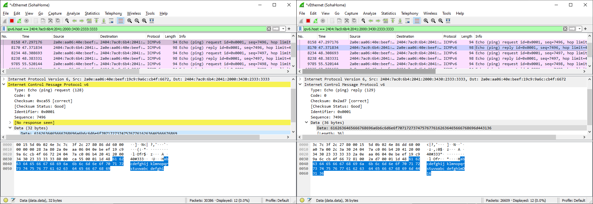

不知道是因为现在大家春节都已经没那么闲了，还是因为今年的题目出的确实不好（我觉得还是这个可能性大一点），本来预计会有很多人领的红包（因此给的额度也很大），结果并没多少人来领取。于是我不断地加提示，在 T+03:15:00、T+17:30:00、T+22:30:00 分别给了 3 个提示。


这次红包活动一共有 3 个红包，相互独立。所有提示和入口均可以在红包页面找到。

### 彩包

点开这个祖传的红包页面后，首先就可以看到一个颜色变化的红包。


红包就是红包，怎么会变成棕红橙黄绿蓝紫灰包呢？事出反常必有妖。这些颜色都被定义在网页源代码中，我们查看源代码，可以找到这个：

```javascript
var colors = ["#673424","#da1313","#fa7e23","#fed71a","#5bae23","#15559a","#7e1671","#856d72","#673424","#da1313","#fa7e23","#fed71a","#5bae23","#15559a","#7e1671","#856d72","#673424","#da1313","#fa7e23","#5bae23","#15559a","#7e1671","#673424","#da1313","#5bae23","#15559a","#7e1671","#da1313","#5bae23","#15559a","#da1313","#5bae23","#15559a","#da1313","#5bae23","#da1313","#5bae23","#da1313","#5bae23"];
```

看似眼花缭乱，但是我们一下就能看出几个重复的颜色，统计后会发现总共只有 8 种颜色。接着再统计一下，会发现每种颜色出现的次数是不一样的。按照它们第一次出现的顺序把它们出现的次数连起来，就会得到一个 8 位的红包口令：49329642。


这个红包还有个小彩蛋，“棕红橙黄绿蓝紫灰”就是色环电阻表示 1~8 的顺序。

这个红包最后被领走 13 个，第一个在 T+03:29:07 （第一次提示后）被领走，在第二次提示前共被领走 8 个。

### 小故事

这个小故事点击“开”后即可获得，全文如下：

> 新年到了，该去拜年了。爸爸拍拍嗖蛤的肩膀：“你开车。”“啊？可是我不知道去哪儿啊……”“我们要去的这个亲戚住在 4A 级风景区，`22landscape.hb.lohu.info`，你用导航搜下不就行了。”嗖蛤觉得有点奇怪，问：“这是哪个亲戚啊，好像没听说过？”“你确实没印象，你上次见到他是很小的时候了。不过问题不大，你搜下他家地址就可以知道是谁了。他家门牌边上也有一张纸贴着他的介绍。”
>
> 经过一段时间的车程，他们到达了这个亲戚家。他们进行了愉快的交流。这个亲戚家非常大，大到可以产生很多回音。“啊——”嗖蛤就像来到一个空旷的山谷一样，喊了一声。但是因为亲戚家墙上挂的东西也很多，所以回音多多少少有点失真，就像是台坏掉的复读机。
>
> 时间过得很快，一下就快到饭点了。“留下来吃个晚饭吧。”亲戚热情地挽留。“不了不了，我们回去了。”爸爸说。“来来来，这个拿着。”亲戚掏出一个红色的纸包，尝试塞给嗖蛤。“嗨呀，不用给了啦。”“拿着拿着。”“不用不用。”……经过一番客套，最终还是拿上了红包，回了家。

这个小故事是一整个红包，只要理解里面所有隐含意义，解出这道题目就很简单了。我先来介绍一下其中的各种隐含意义：

1. 4A 级风景区 → AAAA 记录
1. 导航 → DNS
1. 他家门牌边上一张纸 → TXT 记录
1. 这是谁 → whois
1. 他家地址 → IP 地址
1. 回音 = ICMP echo
1. “啊——” = ICMP echo request
1. 回音失真 = ICMP echo reply 被下了毒

然后我们就可以逐个击破了。首先先查询 DNS 获得“亲戚家的地址” `2404:7ac0:6b4:2041:2000:3430:2333:3333` 和 TXT 记录：


拿到了第二组口令，63。第一组口令其实就在 IPv6 地址里面：`0x204120003430 = " A  40"`，不过这里不好看出，你可能更容易在获得第四组口令的时候看出来。

第三组口令则是根据“这是谁？”“你搜下他家地址就知道了”中所暗示的 whois 指令获得。


remarks 部分的乱码就很容易引起注意，有经验的话可以看出是古典加密。这里实际上是 ROT22 编码的内容，我们用 ROT4 就能还原回去：

```
Wow, you found who I am.
The hongbao has four slices,
and this slice of code is C nine seven.
```

然后得到第三组口令 97，同时这里我们还得知了红包口令一共有 4 个小片段。第四组口令则是根据“亲戚家墙壁的回音有失真”来获得，回音的英文是 echo，和 echo 有关的网络协议是 7 号端口的 echo 和 ICMP 的 echo request/reply。7 号端口没开，所以是 ICMP echo。

如下图所示，我们可以看出来所有 reply 包后面都被追加了 `mD16`。所以 16 就是第四组口令。在这个图里，也能看出 IPv6 地址的部分有 A40。



不过最后这个 ICMP echo 对于 BSD 用户会有非常明显的提醒：

```
20 bytes from 2404:7ac0:6b4:2041:2000:3430:2333:3333, icmp_seq=0 hlim=50 time=97.748 ms
wrong data byte #8 should be 0x0 but was 0x6d
```

而经常使用 ping 的 Linux 用户、或者是对报文大小敏感的同学也可以看出一些端倪，因为 Linux 默认的 payload 大小是 56，+ 4 ICMP header + 4 ICMP echo ID & SeqNo 应该是 64，而返回的长度是 68。


```
PING 2404:7ac0:6b4:2041:2000:3430:2333:3333(2404:7ac0:6b4:2041:2000:3430:2333:3333) 56 data bytes
68 bytes from 2404:7ac0:6b4:2041:2000:3430:2333:3333: icmp_seq=1 ttl=55 time=94.6 ms
```

这个阶段所使用的 ICMP echo 服务端可以在[GitHub 的仓库里](https://github.com/moesoha/red-packet-2022/tree/master/part2/icmp-echo-client)找到。

这个红包最后被领走 5 个，第一个在 T+03:32:58 （第一次提示后）被领走，在第二次提示前共被领走 3 个。

### 音乐

点击“开”后开始播放的音乐也是一个红包。我认为这个红包是我今年，或者说是我做了这么多年红包游戏以来最失败的一个。

大家应该都会对这个背景音乐耳熟，也就是“新年好呀，新年好呀，祝贺大家新年好。我们唱歌，我们跳舞，祝贺大家新年好。”同时这个音乐的文件名为 `1=F.aac`，这里暗示的是以 F 大调的第一个音作为 do 的简谱记法。

而除了主旋律之外，我一共在 8 个主旋律的音上配了和弦，只要把配了和弦的音找出来，并把它的简谱记法依次写出来，就可以获得红包口令：13524311。


而从音乐扒谱确实是专业人士的技能，不过只要能听出来音乐是《新年好》，就可以直接去搜索它的简谱，它的简谱绝大部分就是 F 大调的，所以可以直接用。因此这里的重点就是找出被配了和弦的音，我本来以为这也是一个比较容易的事情，结果发现我还是太年轻。

所以最后 90 分钟的时候我更新了一个和音乐对应的 MIDI 序列，是和音频一起录下来的。之所以在设计题目的时候选择放音乐而不是 MIDI 序列，主要还是因为想让浏览器直接播放，增添节日气氛。不过尽管放了 MIDI 序列，不过还是没人发现这一点，因此这道题目最后还是无人解出。

唉，这次的红包确实比往年要差。剩下没发出的红包金额，我把没发完的红包金额的一部分以这个口令重新发给看到末尾的你：嗖蛤出的什么破红包。
